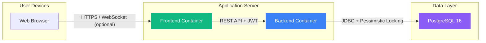
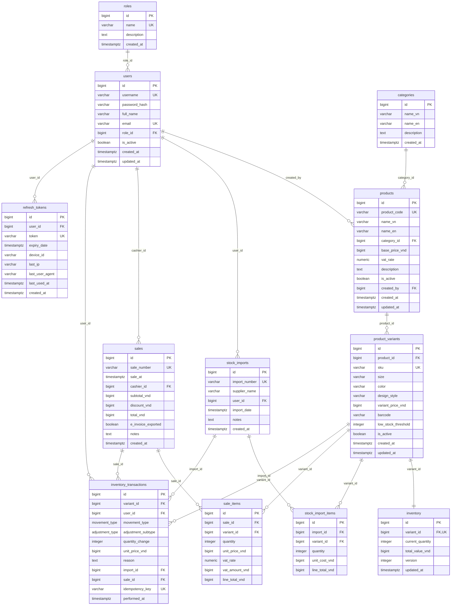

# Hệ thống quản lý kho - Inventory Management System

## Giới thiệu dự án

Dự án này xây dựng hệ thống quản lý tồn kho dạng monolithic dành cho các cửa hàng bán lẻ vừa và nhỏ tại Thành phố Hồ Chí Minh, chuyên kinh doanh quà lưu niệm và quần áo.

Hệ thống đảm bảo độ chính xác tồn kho tuyệt đối (100%) , hỗ trợ đầy đủ các nghiệp vụ bán lẻ đặc thù tại Việt Nam như quản lý biến thể sản phẩm, báo cáo Nhập - Xuất - Tồn, và hỗ trợ xuất dữ liệu phục vụ hóa đơn điện tử. Bên cạnh đó, hệ thống còn cung cấp khả năng phân quyền truy cập theo vai trò (role‑based security) cùng tính năng ghi nhận đầy đủ lịch sử thao tác (audit log). Toàn bộ giải pháp được thiết kế với triết lý đơn giản, hiệu suất cao và có thể tự lưu trữ (self-hosted).

## Case Study

### Bối Cảnh (Context)
Tại thị trường bán lẻ Việt Nam (đặc biệt là TP.HCM), các cửa hàng lưu niệm và thời trang quy mô vừa và nhỏ thường phải quản lý một lượng lớn hàng hóa (hơn 1,000+ SKUs) với mạng lưới biến thể phức tạp (kích cỡ, màu sắc, kiểu dáng). Phần lớn các cửa hàng này đang phụ thuộc vào quy trình thủ công (Excel) hoặc các phần mềm thiếu tính chặt chẽ về dữ liệu, dẫn đến nhiều lỗ hổng trong vận hành và kế toán.

### Bài Toán Cốt Lõi (The Core Problems)
Dự án này được sinh ra để giải quyết 4 "nỗi đau" (pain points) lớn nhất của các chủ cửa hàng:

* **Vấn đề bán âm kho (Negative Stock & Race Conditions):** Trong những giờ cao điểm, việc 2 thu ngân cùng chốt đơn cho một sản phẩm cuối cùng trên kệ thường dẫn đến lỗi dữ liệu, làm tồn kho bị âm và gây ảnh hưởng trực tiếp đến trải nghiệm khách hàng.
* **Thất thoát dữ liệu & Thiếu minh bạch (Lack of Auditability):** Khi có sai lệch kho, chủ cửa hàng không thể truy vết được ai là người thay đổi số lượng, thay đổi khi nào và với lý do gì (bán hàng, nhập kho, hàng hư hỏng hay hao hụt nội bộ).
* **Đặc thù kế toán Việt Nam (Localization Requirements):** Các hệ thống chuẩn quốc tế thường không hỗ trợ trích xuất báo cáo **Nhập - Xuất - Tồn** đúng chuẩn kế toán Việt Nam, đồng thời thiếu khả năng tương thích định dạng dữ liệu để xuất **Hóa đơn điện tử** cho cơ quan thuế.
* **Sự phức tạp của biến thể sản phẩm (Variant Matrix):** Quản lý tồn kho theo từng sản phẩm gốc là chưa đủ. Các cửa hàng thời trang cần một cái nhìn tổng quan theo ma trận (Ví dụ: Áo thun A - Màu Đỏ - Size M còn bao nhiêu cái).

### Cách Tiếp Cận & Giải Pháp
Thay vì xây dựng một hệ thống phân tán (Microservices) rườm rà cho một cửa hàng nhỏ, hệ thống được thiết kế theo kiến trúc **Monolithic** tinh gọn, tập trung 100% vào **tính toàn vẹn của dữ liệu (Data Integrity)**:

1.  **Đảm bảo độ chính xác 100% (Zero Data Corruption):** Sử dụng cơ chế **Pessimistic Locking** kết hợp với **ACID Transactions** (@Transactional) trong Spring Boot & PostgreSQL. Bất kỳ giao dịch nào dẫn đến tồn kho âm hoặc lỗi nhập liệu bán phần đều bị Rollback hoàn toàn. Cơ chế khóa chặn (lock) đảm bảo khi 2 cashier cùng thao tác trên 1 item cuối cùng, chỉ 1 giao dịch thành công.
2.  **Lịch sử thay đổi tuyệt đối (Full Audit Trail):**
    Tích hợp **Hibernate Envers** để lưu vết (audit) mọi thay đổi (CRUD) trên kho. Mỗi thay đổi đều gắn liền với người thực hiện, thời gian, giá trị trước/sau và lý do bắt buộc (Role-Based Access Control).
3.  **Bản địa hóa quy trình báo cáo (VN-Market Ready):**
    Tích hợp sẵn bộ lọc và tính toán tự động để xuất báo cáo Nhập-Xuất-Tồn (tính bằng VNĐ) chỉ với 1 click, kèm theo module xuất dữ liệu định dạng chuẩn để phục vụ hệ thống Hóa đơn điện tử của bên thứ ba.
4.  **Tối ưu chi phí & Triển khai nhanh chóng:**
    Kiến trúc Monolith giúp tiết kiệm tối đa chi phí hạ tầng, dễ dàng triển khai On-premise hoặc trên một máy chủ VPS đơn giản, phù hợp với ngân sách của mô hình kinh doanh nhỏ và vừa.

## Kiến trúc hệ thống và Công nghệ sử dụng

### 1. Kiến trúc hệ thống

Dự án được xây dựng theo kiến trúc **Monolithic 3-Tier (3 lớp)**, ưu tiên sự ổn định, dễ bảo trì và triển khai nhanh chóng. Hệ thống phân tách rõ ràng giữa Frontend (Client-side Rendering) và Backend cung cấp RESTful APIs.

### 2. Công nghệ sử dụng

**Frontend: Giao diện người dùng (Client-Side)**
* **Core:** React.js kết hợp với **TypeScript** để đảm bảo an toàn kiểu dữ liệu (type-safety), giảm thiểu lỗi runtime trong quá trình cashiers thao tác bán hàng.
* **Build Tool:** **Vite** mang lại tốc độ khởi tạo và Hot Module Replacement (HMR) cực nhanh, tối ưu hóa quá trình phát triển và build production.
* **Giao tiếp API:** `Axios` hoặc `Fetch API` kết hợp với Interceptors để tự động đính kèm JWT Tokens cho mọi request.
* **UI Library:** **Shadcn UI** (dựa trên Radix UI) giúp xây dựng giao diện hiện đại, responsive và dễ sử dụng cho cả desktop và tablet.

**Backend: Xử lý nghiệp vụ (Server-Side)**
* **Core:** **Spring Boot** (Java) - Môi trường lý tưởng và mạnh mẽ nhất để xây dựng các hệ thống yêu cầu tính toàn vẹn giao dịch (transactional integrity) cao.
* **Bảo mật & Phân quyền:** **Spring Security + JWT (JSON Web Tokens)**. Đảm bảo API stateless, xác thực người dùng và phân quyền chặt chẽ theo RBAC (Admin, Manager, Cashier, Viewer).
* **ORM & Truy xuất dữ liệu:** **Spring Data JPA** & **Hibernate**.
* **Audit Logging:** **Hibernate Envers** tự động tracking mọi thao tác (Insert, Update, Delete) trên các Entity quan trọng, lưu lại lịch sử thay đổi (Ai, Khi nào, Dữ liệu cũ/mới) để phục vụ tra soát.

**Database: Lưu trữ dữ liệu**
* **Hệ quản trị CSDL:** **PostgreSQL**. Lựa chọn tối ưu nhất cho hệ thống kho hàng nhờ khả năng xử lý **ACID Transactions** cực kỳ khắt khe và hỗ trợ tốt các truy vấn phức tạp cho báo cáo Nhập-Xuất-Tồn.

## Thiết kế cơ sở dữ liệu

